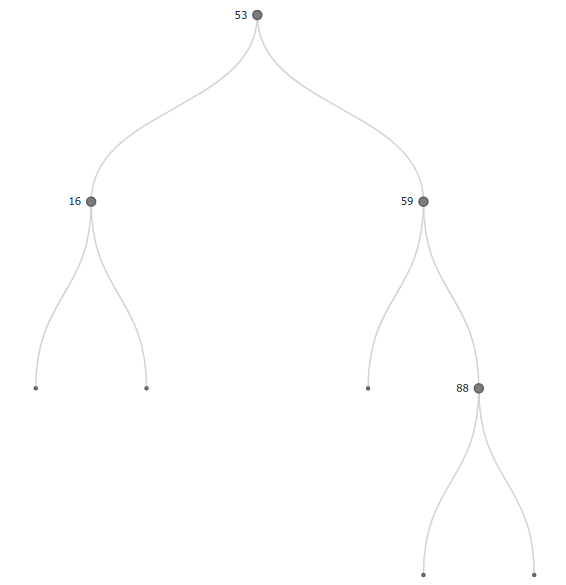
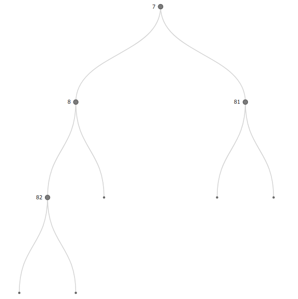

# 20200127 Exercises

## Liam Godin

# Page 4 exercise 1

	typedef struct {
		int roomNumber;
		double treasure;
		bool searched;
		bool alarm;
		bool alarmTriggered;
	}Room;

# Page 4 exercise 2

The infrastructure of the LinkedList should not change, as the List does not handle the details of the Room datatype, only the existence of the Room.

# Page 5 exercise 1

	LLNode* temp = lp;
	while(temp->next) {
		printf(temp->payP->roomNumber;
		temp=(LLNode*)temp->payP->next;
	}
	printf(temp->payP->roomNumber);

# Page 6 exercise 2

	LLNode* temp = lp;
	int oldNum = -999;
	while(temp != 0) {
    		if(temp->payP->roomNumber > oldNum) {
        		printf(temp->payP->roomNumber);
		}
	oldNum = temp->payP->roomNumber;
	temp=(LLNode*)temp->next;
	}

# Page 6 exercise 1

	LLNode* temp = lp;
	int oldNum = -999;
	int count = 0;
	LLNode* lastNode = 0;
	while(temp != 0) {
		if(temp->payP->roomNumber > oldNum) {
			printf("Room Number: %i", temp->payP->roomNumber);
		}
		oldNum = temp->payP->roomNumber;
		lastNode = temp;
		temp=(LLNode*)temp->prev;
	}
	LLNode* temp = lastNode;
	while(temp != 0) {
		count++;
		temp = (LLNode*)temp->prev;
	}
	printf("Count: %i", count);

# Page 8 exercise 1

Yes. If all elements are connected to themselves, the middle diagonal will have all 1s.

# Page 8 exercise 2

Yes. with no directed edges, there will be a reflexive nature in the matrix, making it symmetrical about the main diagonal.

# Page 9 exercise 1

This code places symmetrical 1s in the adjacency matrix, which is used for undirected edges.

# Page 9 exercise 2

	void setEdge(AdjMat* adjMP, int row, int col) {
		int ncols = adjMP->n;
		int* arrayBeginning = adjMP->edgesP;
		*(arrayBeginning + (ncols*row) + col) = 1;
	}

# Page 10 exercise 1

{width=50%}
{width=50%}

# Page 11 exercise 1

A leaf is indicated by both the left and right pointers being equal to zero, causing no additional nodes to follow.

When adding a new leaf node, we must do:

	LLNode* aLeaf = // a leaf node
	aLeaf->left = 0;
	aLeaf->right = 0;

	if(node->left == 0 && node->right == 0) {
		// is leaf node
	}

